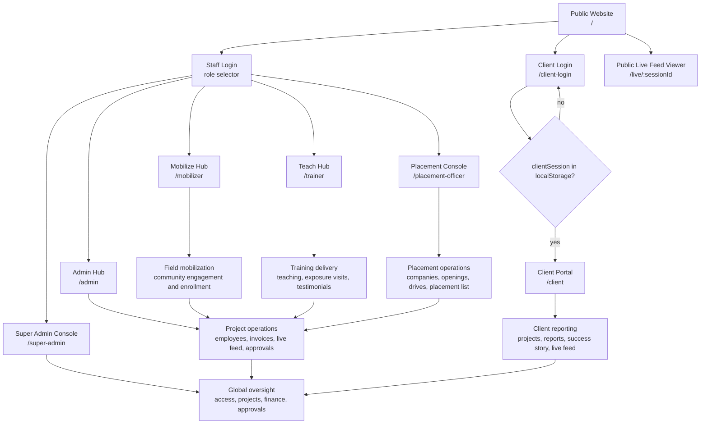
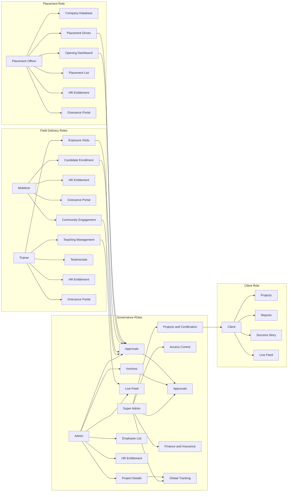
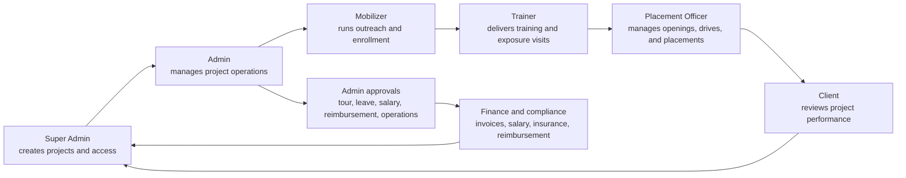

# Pantiss ERP

Pantiss ERP is a role-based React and Vite application for program delivery, training, placement, HR entitlement, approvals, finance, live monitoring, and client reporting.

## Role-Based App Flow



## Operational Flow By Role



## Role Route Map

| Role | Scope | Entry route | Primary flows |
| --- | --- | --- | --- |
| Super Admin | Global | `/super-admin/dashboard` | Projects, batch certification, live feed, approvals, grievances, finance, insurance, access control, user management, project creation, settings |
| Admin | Project | `/admin/dashboard` | Project details, invoices, live feed, approvals, employee list, HR entitlement, testimonials, profile |
| Mobilizer | Center | `/mobilizer/dashboard` | Community engagement, candidate enrollment, attendance, leave, tour, salary, reimbursement, grievances, profile |
| Trainer | Batch | `/trainer/dashboard` | Teaching management, exposure visits, testimonials, leave, salary, reimbursement, grievances, profile |
| Placement Officer | Project | `/placement-officer/dashboard` | Company database, opening dashboard, placement drives, placement list, testimonials, attendance, leave, tour, salary, reimbursement, grievances, profile |
| Client | Project | `/client/dashboard` | Dashboard, projects, reports, success story, live feed |
| Executive | Global | Not routed in `src/App.jsx` | Role exists in mock auth and access-control data, but no active UI route is currently wired |

## End-To-End Program Lifecycle



## Shared Workflows

- **HR Entitlement:** Attendance, leave, tour, salary, and reimbursement are shared across eligible staff roles.
- **Grievance:** Mobilizer, Trainer, and Placement Officer submit or track grievances; Admin and Super Admin monitor escalations.
- **Approvals:** Admin handles project-level approvals; Super Admin handles global approvals, finance checks, and oversight.
- **Live Feed:** Trainer can host or expose monitoring sessions; Admin, Super Admin, Client, and public live routes can view live feeds.
- **Client Access:** Client users sign in through `/client-login`; protected client routes require a `clientSession` value in `localStorage`.

## Source Of Truth

This flow is based on:

- `src/App.jsx`
- `src/components/Sidebars/*Sidebar.jsx`
- `src/components/Layout/ClientLayout.jsx`
- `src/pages/Client/ClientProtectedRoute.jsx`
- `src/mock-db/auth/index.js`
- `src/mock-db/shared/enums.js`

## Development

```bash
npm install
npm run dev
```
