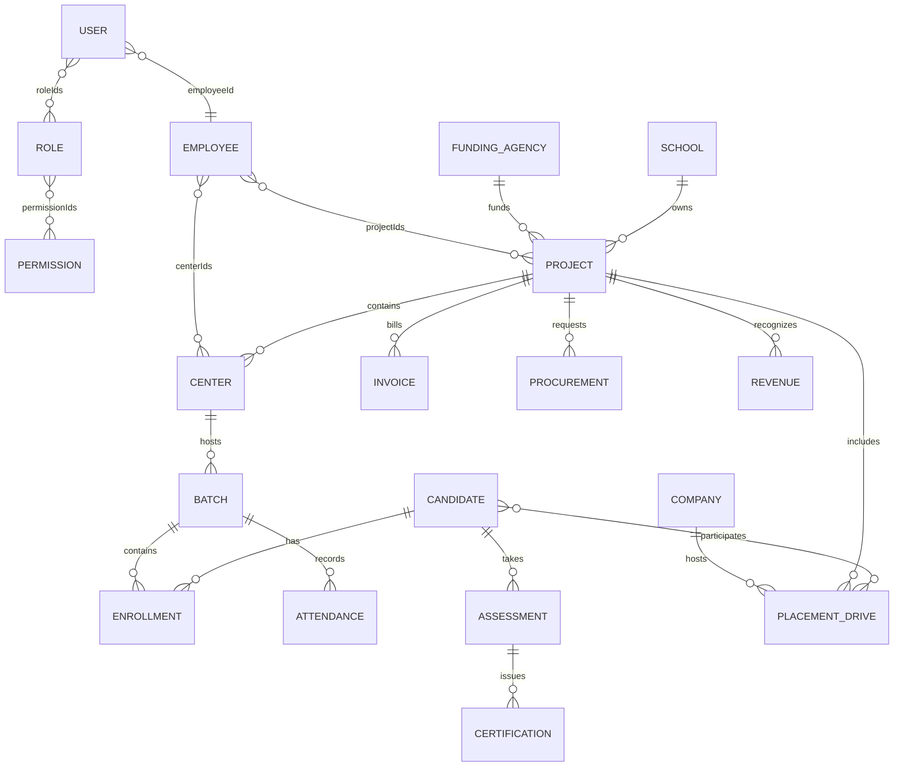

# Pantiss ERP App Workflow And Backend Schema

This document is a backend handoff for the current React/Vite ERP frontend. It is based on the routed pages, Zustand stores, services, mock database, selectors, and stepper forms in the codebase.

## 1. Application Summary

Pantiss ERP is a role-based program management platform for skill development operations. The app covers:

- Public website and client login
- Client portal
- Mobilizer portal
- Trainer portal
- Placement officer portal
- Admin portal
- Super Admin portal
- Shared HR, finance, grievance, attendance, and approval workflows

The frontend is already organized around a backend-shaped mock layer:

```txt
Page/Component -> Zustand Store -> Domain Service -> Mock API Client -> Normalized mockDb
```

Backend development should preserve this shape so services can be swapped from mock data to real API calls with minimal UI changes.

## 2. Technology Context

- Frontend: React 19, Vite, React Router, Zustand
- Charts/UI support: Recharts, Lucide, React Icons
- Exports: jsPDF, xlsx, exceljs, file-saver
- Maps/location: Leaflet, React Leaflet, browser geolocation, Nominatim/OpenStreetMap lookup
- Media capture: browser camera APIs for live photo capture

## 3. Roles And Access Scope

| Role | Code | Scope | Main Backend Access |
| --- | --- | --- | --- |
| Super Admin | `SUPER_ADMIN` | Global | Full CRUD, approvals, exports, monitoring across all projects |
| Admin | `ADMIN` | Project | Project employees, centers, batches, candidates, attendance, approvals, finance |
| Trainer | `TRAINER` | Batch | Assigned batches, candidate attendance, assessments, exposure visits, training activity |
| Mobilizer | `MOBILIZER` | Center | Candidate mobilization, enrollment, tours, reimbursements, center-level dashboards |
| Placement Officer | `PLACEMENT_OFFICER` | Project | Companies, placement drives, placed candidates, placement revenue |
| Client | `CLIENT` | Project | Read-only project reports, performance, live feed, exports |
| Executive | `EXECUTIVE` | Global | Read-only analytics, grants, compliance, audit. Note: executive pages exist but are not wired in `App.jsx` routes yet. |

Client users can now be generated from Super Admin project creation. A generated client account is scoped to one or more `projectIds` and is used by the client portal login alongside the built-in demo client accounts.

Every authenticated request should resolve:

```json
{
  "userId": "USR-0001",
  "employeeId": "EMP-0008",
  "roleCodes": ["SUPER_ADMIN"],
  "projectIds": ["PRJ-0001"],
  "centerIds": ["CTR-0001"],
  "batchIds": ["BTH-0001"]
}
```

## 4. Routed App Modules

### Public

| Route | Purpose |
| --- | --- |
| `/` | Public home page |
| `/about` | About page |
| `/client-login` | Client login |
| `/live/:sessionId` | Public trainer live feed viewer |
| `/trainer/live/:sessionId` | Trainer live feed viewer |

### Client Portal

Base route: `/client`

| Route | Workflow |
| --- | --- |
| `/client/dashboard` | Project summary and client KPIs |
| `/client/projects` | Client-visible project list filtered by `clientSession.projectIds` / client account scope |
| `/client/projects/:projectId` | Project detail with center, batch, training, placement, certification, gallery, and evidence review data |
| `/client/performance` | Performance analytics |
| `/client/reports` | Exportable reports |
| `/client/success-story` | Testimonials/success story view |
| `/client/live-feed` | Client-visible live monitoring |

### Mobilizer Portal

Base route: `/mobilizer`

| Route | Workflow |
| --- | --- |
| `/mobilizer/dashboard` | Mobilizer dashboard |
| `/mobilizer/student-enrollment` | Candidate enrollment and admit card generation |
| `/mobilizer/community-engagement` | Community/tour/mobilization history |
| `/mobilizer/attendance` | Mobilizer attendance |
| `/mobilizer/profile` | Profile settings, currently local storage backed |
| `/mobilizer/revenue` | Mobilizer revenue/earnings |
| `/mobilizer/hr/leave` | Leave application |
| `/mobilizer/hr/tour` | Tour application |
| `/mobilizer/hr/salary` | Salary dashboard |
| `/mobilizer/hr/reimbursement` | Reimbursement claims |
| `/mobilizer/grievance` | Grievance creation/tracking |

### Trainer Portal

Base route: `/trainer`

| Route | Workflow |
| --- | --- |
| `/trainer/dashboard` | Trainer dashboard |
| `/trainer/attendance` | Candidate/employee attendance marking |
| `/trainer/exposure-visits` | Exposure visit create/update/report |
| `/trainer/study-modules` | Module/LMS navigation |
| `/trainer/labs` | Lab/module tracking |
| `/trainer/live-feed-host` | Live feed hosting |
| `/trainer/revenue` | Trainer earnings |
| `/trainer/testimonials` | Testimonial management |
| `/trainer/hr/leave` | Leave application |
| `/trainer/hr/salary` | Salary dashboard |
| `/trainer/hr/reimbursement` | Reimbursement claims |
| `/trainer/grievance` | Grievance creation/tracking |

### Placement Officer Portal

Base route: `/placement-officer`

| Route | Workflow |
| --- | --- |
| `/placement-officer/dashboard` | Placement dashboard |
| `/placement-officer/company-database` | Company registry, MoU/LOI document workflow |
| `/placement-officer/placement-drives` | Placement drives, evidence, placed student outcomes |
| `/placement-officer/placements-list` | Placed candidate list |
| `/placement-officer/job-openings` | Job opening dashboard derived from placement drives |
| `/placement-officer/revenue` | Placement revenue |
| `/placement-officer/profile` | Profile settings, currently local storage backed |
| `/placement-officer/hr/*` | Shared attendance, leave, tour, salary, reimbursement |
| `/placement-officer/grievance` | Grievance creation/tracking |

### Admin Portal

Base route: `/admin`

| Route Group | Workflows |
| --- | --- |
| Dashboard | `/admin/dashboard` |
| User/employee | employee list, user management, add user stepper, trainer/mobilizer dashboards |
| Project/center | project management, add project stepper, center management, project reports |
| Candidates | candidate approvals, kit distribution, insurance, batch certification |
| Training | trainer attendance, exposure visit approvals, module progress, live feed |
| Placement | placement drive approvals, placement tracker |
| Finance | invoices, salary approvals, procurement, reimbursement approvals |
| HR | attendance, leave approvals, salary, reimbursement |
| Shared | reports, settings, profile, testimonials, grievance portal |

### Super Admin Portal

Base route: `/super-admin`

| Route Group | Workflows |
| --- | --- |
| Monitoring | enrollment, training, placement, attendance, invoices, finance |
| Finance approvals | invoices, reimbursements, salary approvals, insurance |
| Drilldowns | mobilizer detail, trainer detail, placement officer detail |
| Access control | user management, employee management, project/trainer/placement assignment |
| Projects | create projects, project details, candidate details |
| Operations | mobilization, community drives, training tracking, exposure visits, batch certification |
| Placement | placement drives, openings/job openings, live feed |
| Approvals | operations, tour, leave, salary, invoices, reimbursements |
| Shared | grievance tracker, settings, profile |

## 5. Core Entity Model

Use one normalized table per business concept. IDs should keep stable prefixes for readability and debugging.

| Entity | ID Prefix | Owner Domain | Required Relations |
| --- | --- | --- | --- |
| User | `USR` | Auth | `employeeId`, `roleIds[]` |
| ClientAccount | `CLI` | Auth/Client | `projectIds[]`, optional `fundingAgencyId` |
| Role | `ROL` | Auth | `permissionIds[]` |
| Permission | `PER` | Auth | none |
| Employee | `EMP` | HR | `roleIds[]`, `projectIds[]`, `centerIds[]`, `assignedBatchIds[]` |
| Trainer | `TRN` | HR | `employeeId`, `batchIds[]` |
| Mobilizer | `MOB` | HR | `employeeId`, `centerIds[]` |
| PlacementOfficer | `PLO` | HR | `employeeId`, `projectIds[]`, `centerIds[]` |
| FundingAgency | `FAG` | Operations | none |
| School | `SCH` | Operations | none |
| Project | `PRJ` | Operations | `fundingAgencyId`, `schoolId` |
| Center | `CTR` | Operations | `projectId`, `managerEmployeeId` |
| Batch | `BTH` | Training | `projectId`, `centerId`, `trainerEmployeeId` |
| Candidate | `CND` | Training | `mobilizerEmployeeId` |
| Enrollment | `ENR` | Training | `candidateId`, `projectId`, `centerId`, `batchId` |
| Attendance | `ATD` | Training/HR | `subjectType`, `subjectId`, `projectId`, `centerId`, `batchId`, `markedByEmployeeId` |
| Assessment | `ASM` | Training | `candidateId`, `batchId` |
| Certification | `CRT` | Training | `candidateId`, `assessmentId` |
| Insurance | `INS` | Training | `candidateId` |
| Company | `CMP` | Placement | none |
| PlacementDrive | `DRV` | Placement | `companyId`, `projectId`, `centerId`, `placementOfficerEmployeeId`, `candidateIds[]` |
| LeaveRequest | `LEV` | HR | `employeeId`, `approverEmployeeId` |
| Salary | `SAL` | HR/Finance | `employeeId`, `projectId` |
| Reimbursement | `RIM` | Finance | `employeeId`, `projectId` |
| TourRequest | `TOU` | Mobilization | `employeeId`, `projectId`, `centerId` |
| Grievance | `GRV` | Shared | `raisedByType`, `raisedById`, `projectId`, `centerId` |
| Invoice | `INV` | Finance | `projectId`, `centerId` |
| Procurement | `PRC` | Operations/Finance | `projectId`, `centerId`, `requestedByEmployeeId` |
| ExposureVisit | `EXV` | Operations/Training | `projectId`, `centerId`, `batchId`, `companyId` |
| Revenue | `REV` | Finance | `projectId`, `centerId` |
| DashboardMetrics | `MET` | Analytics | `scopeType`, `scopeId` |
| Notification | `NOT` | Shared | `recipientUserId` |
| AuditLog | `AUD` | Shared | `actorUserId`, `entityType`, `entityId` |
| FileUpload | `FIL` | Shared | `ownerType`, `ownerId` |
| Testimonial | `TST` | Shared | `candidateId`, `projectId`, `centerId` |

## 6. Relationship Graph



Canonical lifecycle:

```txt
Project -> Center -> Batch -> Enrollment -> Candidate -> Attendance -> Assessment -> Certification -> PlacementDrive -> Revenue
```

## 7. Status Enums

Backend should standardize casing to uppercase codes. Some older UI labels still use title case in display logic; API responses should prefer these canonical values.

```json
{
  "ENTITY_STATUS": ["ACTIVE", "INACTIVE", "DRAFT", "PENDING", "APPROVED", "REJECTED", "COMPLETED", "ON_HOLD"],
  "EMPLOYEE_STATUS": ["ACTIVE", "ON_LEAVE", "PROBATION", "EXITED"],
  "PROJECT_STATUS": ["ACTIVE", "MONITORING", "COMPLETED", "SUSPENDED"],
  "CANDIDATE_STATUS": ["MOBILIZED", "ENROLLED", "IN_TRAINING", "ASSESSED", "CERTIFIED", "PLACED", "DROPPED"],
  "ATTENDANCE_STATUS": ["PRESENT", "ABSENT", "HALF_DAY", "LEAVE"],
  "REQUEST_STATUS": ["DRAFT", "SUBMITTED", "UNDER_REVIEW", "APPROVED", "REJECTED", "PAID", "CLOSED"],
  "GRIEVANCE_STATUS": ["OPEN", "IN_REVIEW", "RESOLVED", "ESCALATED"],
  "PLACEMENT_STATUS": ["SCHEDULED", "IN_PROGRESS", "COMPLETED", "CANCELLED"],
  "REVENUE_TYPE": ["TRAINING_GRANT", "PLACEMENT_INCENTIVE", "CSR_TRANCHE", "REIMBURSEMENT"]
}
```

Current finance reimbursement UI also uses `ADMIN_APPROVED`. Either add it as an explicit reimbursement status or map it to `UNDER_REVIEW` plus an approval-level field.

## 8. Backend API Response Standard

All list/detail/mutation endpoints should return this shape:

```json
{
  "data": {},
  "meta": {
    "count": 1,
    "entity": "candidates",
    "page": 1,
    "pageSize": 25
  }
}
```

For validation errors:

```json
{
  "error": {
    "code": "VALIDATION_ERROR",
    "message": "Phone number must be 10 digits",
    "fields": {
      "phone": "Invalid phone number"
    }
  }
}
```

Recommended common query params:

- `filters[projectId]=PRJ-0001`
- `filters[centerId]=CTR-0001`
- `filters[batchId]=BTH-0001`
- `filters[status]=IN_TRAINING`
- `include=project,center,batch,employee,company,candidate,roles`
- `search=sasmita`
- `page=1&pageSize=25`
- `sort=-createdAt`

## 9. Required Endpoint Groups

### Auth And Session

| Method | Endpoint | Purpose |
| --- | --- | --- |
| `POST` | `/api/auth/login` | Email/password or client login |
| `POST` | `/api/auth/client-login` | Client portal login by generated/static client account |
| `GET` | `/api/auth/session` | Current user, employee, roles, scopes |
| `POST` | `/api/auth/logout` | Clear server session/token |
| `GET` | `/api/users` | User list |
| `POST` | `/api/users` | Create user credentials |
| `PATCH` | `/api/users/:id` | Update user status/roles |
| `GET` | `/api/client-accounts` | Client account list for Super Admin/Admin visibility |
| `POST` | `/api/projects/:id/client-account` | Generate or rotate client portal credentials for a project |
| `PATCH` | `/api/client-accounts/:id` | Disable, rotate password, or update scoped projects |

Session response should include joined `roles` and `employee` for staff users. Client session response should include `id`, `name`, `email`, `projectIds`, and role code `CLIENT`.

### Master Data

| Method | Endpoint | Purpose |
| --- | --- | --- |
| `GET/POST/PATCH/DELETE` | `/api/employees` | Employee master and assignments |
| `GET/POST/PATCH/DELETE` | `/api/projects` | Project master |
| `GET/POST/PATCH/DELETE` | `/api/centers` | Center master |
| `GET/POST/PATCH/DELETE` | `/api/batches` | Batch master |
| `GET` | `/api/projects/:id/workspace` | Project with centers, batches, staff, metrics |
| `GET` | `/api/projects/:id/report-workspace` | Project report workspace with center-aware training, placement, certification, insurance, evidence, and gallery rows |
| `GET` | `/api/catalog/enrollment` | School -> project -> center -> batch options |

### Candidate Lifecycle

| Method | Endpoint | Purpose |
| --- | --- | --- |
| `GET` | `/api/candidates` | Candidate list |
| `GET` | `/api/candidates/lifecycle` | Candidate plus enrollment, assessment, certification |
| `POST` | `/api/candidates/lifecycle` | Create candidate and optional enrollment together |
| `PATCH` | `/api/candidates/:id` | Update candidate/approval status |
| `POST` | `/api/enrollments` | Create enrollment |
| `PATCH` | `/api/enrollments/:id` | Update enrollment |
| `POST` | `/api/candidates/:id/admit-card` | Generate or persist admit card metadata |

### Attendance And Training

| Method | Endpoint | Purpose |
| --- | --- | --- |
| `GET/POST/PATCH` | `/api/attendance` | Candidate and employee attendance |
| `GET/POST/PATCH` | `/api/assessments` | Internal/external assessments |
| `GET/POST/PATCH` | `/api/certifications` | Certificate records |
| `GET/POST/PATCH` | `/api/exposure-visits` | Exposure visit workflow |
| `GET` | `/api/training/module-progress` | Derived module/progress rows |

### Placement

| Method | Endpoint | Purpose |
| --- | --- | --- |
| `GET/POST/PATCH` | `/api/companies` | Company registry |
| `POST` | `/api/companies/:id/documents` | MoU/LOI and company documents |
| `GET/POST/PATCH` | `/api/placement-drives` | Drive list/create/update |
| `GET` | `/api/placement-drives/:id` | Drive with company/project/center/candidates |
| `POST` | `/api/placement-drives/:id/evidence` | Completion photos/docs |
| `PATCH` | `/api/placement-drives/:id/outcomes` | Candidate placement outcomes |
| `GET` | `/api/job-openings` | Derived or explicit openings dashboard |

### HR And Finance

| Method | Endpoint | Purpose |
| --- | --- | --- |
| `GET/POST/PATCH` | `/api/leave-requests` | Leave workflows |
| `GET/POST/PATCH` | `/api/tour-requests` | Tour workflows |
| `GET/POST/PATCH` | `/api/reimbursements` | Reimbursement claim and approval |
| `GET/POST/PATCH` | `/api/salaries` | Salary rows and approvals |
| `GET/POST/PATCH` | `/api/invoices` | Invoice tracking and approvals |
| `GET/POST/PATCH` | `/api/procurements` | Procurement workflows |
| `GET/POST/PATCH` | `/api/revenue` | Revenue recognition |

### Shared

| Method | Endpoint | Purpose |
| --- | --- | --- |
| `GET/POST/PATCH` | `/api/grievances` | Employee/candidate grievance |
| `GET/POST/PATCH` | `/api/testimonials` | Success stories |
| `POST` | `/api/files` | Upload file and return `FileUpload` record |
| `GET` | `/api/notifications` | Notifications |
| `GET` | `/api/audit-logs` | Audit trail |
| `GET` | `/api/dashboard/enterprise-summary` | Scoped summary metrics |

## 10. Workflow Schemas

### 10.0 Super Admin Project Creation And Client Credentials

Frontend source: `SuperAdminCreateProjects.jsx`.

Super Admin can create a project shell, assign an Admin lead, plan centers/batches, and generate client portal credentials for the project. The current frontend stores generated credentials in `localStorage.generatedClientAccounts`; backend should replace that with a persistent `ClientAccount` table.

Project creation draft:

```json
{
  "name": "PMKVY 4.0 Odisha Skills",
  "fundingAgencyId": "FAG-0001",
  "fundingAgency": "National Skill Development Corporation",
  "schoolId": "SCH-0001",
  "sector": "Skill Development",
  "state": "Odisha",
  "district": "Angul",
  "startDate": "2026-06-12",
  "endDate": "2027-03-31",
  "status": "ACTIVE",
  "totalBatchTarget": 6,
  "plannedBatches": 3,
  "leadEmployeeIds": ["EMP-0007"],
  "centers": [
    {
      "name": "Angul Skill Development Center",
      "district": "Angul",
      "state": "Odisha",
      "managerEmployeeId": "EMP-0007",
      "batches": [
        {
          "code": "ANG-ELEC-101",
          "trade": "Electrical Technician",
          "capacity": 40,
          "trainerEmployeeId": "EMP-0001",
          "startDate": "2026-06-20",
          "endDate": "2026-12-20",
          "status": "ACTIVE"
        }
      ]
    }
  ]
}
```

Generated client account:

```json
{
  "id": "client-pmkvy-4-0-odisha-skills-prj-0001",
  "name": "National Skill Development Corporation",
  "email": "client-pmkvy-4-0-odisha-skills-prj-0001@pantiss-client.org",
  "password": "Pantiss@0001",
  "contact": "National Skill Development Corporation",
  "designation": "Client Portal User",
  "projectIds": ["PRJ-0001"],
  "status": "ACTIVE"
}
```

Backend requirements:

- Generate one default client account when a Super Admin creates a project.
- Allow credential copy/display once during creation, then store only a password hash.
- Support password rotation and account disabling.
- Scope all `/client/*` API reads to the account's `projectIds`.
- Include generated client accounts in client login options only for demo/dev, or provide a secure invitation flow in production.

### 10.1 Candidate Enrollment

Frontend source: Mobilizer student enrollment stepper.

Steps:

1. Select school/project/center/job role from project catalog.
2. Capture address and map coordinates.
3. Capture basic, Aadhaar, qualification, experience, and declaration.
4. Capture live photo and live geolocation.
5. Create Candidate and Enrollment.
6. Admin approves or rejects candidate.
7. Candidate enters training lifecycle.

Create payload:

```json
{
  "candidate": {
    "firstName": "Sasmita",
    "lastName": "Nayak",
    "phone": "9000000001",
    "gender": "Female",
    "district": "Angul",
    "mobilizerEmployeeId": "EMP-0003",
    "status": "IN_TRAINING",
    "address": "House, Street, City, District, State, Pincode",
    "dob": "2002-04-15",
    "aadhaar": "XXXX-XXXX-1234",
    "qualification": "ITI",
    "qualificationTrade": "Electrician",
    "qualificationInstitute": "Govt ITI Angul",
    "qualificationYear": "2024",
    "experience": "0 Years",
    "currentlyEmployed": "No",
    "enrollmentDate": "2026-06-12",
    "liveLocation": {
      "lat": 20.2961,
      "lng": 85.8245,
      "accuracy": 20,
      "place": "Bhubaneswar, Odisha",
      "timestamp": "2026-06-12T10:00:00.000Z"
    },
    "geoLocation": {
      "lat": 20.2961,
      "lng": 85.8245
    }
  },
  "enrollment": {
    "projectId": "PRJ-0001",
    "centerId": "CTR-0001",
    "batchId": "BTH-0001",
    "enrolledOn": "2026-06-12",
    "status": "IN_TRAINING"
  },
  "documents": [
    {
      "ownerType": "Candidate",
      "documentType": "AADHAAR",
      "fileName": "aadhaar.pdf",
      "mimeType": "application/pdf"
    }
  ]
}
```

State transitions:

```txt
MOBILIZED -> ENROLLED -> IN_TRAINING -> ASSESSED -> CERTIFIED -> PLACED
MOBILIZED/ENROLLED -> DROPPED
```

### 10.2 Candidate Approval

Admin view uses candidate lifecycle records.

Actions:

- Approve enrollment: update `Candidate.status = IN_TRAINING`
- Reject enrollment: update `Candidate.status = DROPPED`

Recommended audit:

```json
{
  "entityType": "Candidate",
  "entityId": "CND-0001",
  "action": "APPROVE",
  "actorUserId": "USR-0002",
  "remarks": "Documents verified"
}
```

### 10.3 Attendance

Attendance supports both employees and candidates.

```json
{
  "subjectType": "CANDIDATE",
  "subjectId": "CND-0001",
  "projectId": "PRJ-0001",
  "centerId": "CTR-0001",
  "batchId": "BTH-0001",
  "date": "2026-06-12",
  "status": "PRESENT",
  "markedByEmployeeId": "EMP-0001",
  "source": "TRAINER_ATTENDANCE"
}
```

Employee attendance uses `subjectType = EMPLOYEE`.

### 10.4 Assessment And Certification

Assessment creation:

```json
{
  "candidateId": "CND-0002",
  "batchId": "BTH-0001",
  "assessor": "Sector Skill Council",
  "score": 82,
  "status": "APPROVED"
}
```

Certification creation:

```json
{
  "candidateId": "CND-0002",
  "assessmentId": "ASM-0001",
  "certificateNumber": "CERT-2026-0001",
  "issuedOn": "2026-06-12",
  "certificateFileId": "FIL-0001"
}
```

### 10.5 Placement Company Registration

Company stepper fields:

```json
{
  "name": "Tata Motors",
  "sector": "Automotive",
  "website": "https://example.com",
  "locationType": "Odisha",
  "city": "Bhubaneswar",
  "state": "Odisha",
  "country": "India",
  "spoc": {
    "name": "Hiring Manager",
    "phone": "9876543210",
    "email": "hr@example.com"
  },
  "status": "ACTIVE"
}
```

Company document workflows should use `FileUpload`:

```json
{
  "ownerType": "Company",
  "ownerId": "CMP-0001",
  "documentType": "MOU",
  "fileName": "mou.pdf",
  "mimeType": "application/pdf",
  "url": "/files/mou.pdf"
}
```

### 10.6 Placement Drive

Stepper fields:

```json
{
  "type": "Single Company",
  "companyId": "CMP-0001",
  "projectId": "PRJ-0001",
  "centerId": "CTR-0001",
  "placementOfficerEmployeeId": "EMP-0002",
  "candidateIds": ["CND-0001", "CND-0002"],
  "scheduledOn": "2026-06-20",
  "reportingTime": "09:30",
  "recruitmentLocation": "Angul",
  "driveLocation": "Angul Skill Development Center",
  "contactPerson": "Meera Das",
  "offeredCtc": 192000,
  "jobRoles": "Electrical Technician",
  "vacancies": 25,
  "eligibility": {
    "qualification": "ITI",
    "ageLimit": "18-30",
    "gender": "Any",
    "experience": "Fresher",
    "documents": "Aadhaar, Resume, Certificate"
  },
  "status": "SCHEDULED"
}
```

Completion/outcomes:

```json
{
  "status": "COMPLETED",
  "completedOn": "2026-06-20",
  "evidenceFileIds": ["FIL-0002"],
  "outcomes": [
    {
      "candidateId": "CND-0001",
      "selectionStatus": "SELECTED",
      "designation": "Technician",
      "salary": 16000,
      "joiningDate": "2026-07-01",
      "offerLetterFileId": "FIL-0003"
    }
  ]
}
```

### 10.7 Exposure Visit

```json
{
  "projectId": "PRJ-0001",
  "centerId": "CTR-0001",
  "batchId": "BTH-0001",
  "companyId": "CMP-0001",
  "visitDate": "2026-06-30",
  "status": "SUBMITTED",
  "requestedByEmployeeId": "EMP-0001",
  "purpose": "Industry exposure",
  "participantCandidateIds": ["CND-0001", "CND-0002"],
  "reportFileIds": []
}
```

Approval:

```txt
SUBMITTED -> UNDER_REVIEW -> APPROVED -> COMPLETED -> CLOSED
SUBMITTED/UNDER_REVIEW -> REJECTED
```

### 10.8 Leave Request

```json
{
  "employeeId": "EMP-0001",
  "fromDate": "2026-06-14",
  "toDate": "2026-06-15",
  "reason": "Medical",
  "status": "SUBMITTED",
  "approverEmployeeId": "EMP-0007"
}
```

### 10.9 Tour Request

```json
{
  "employeeId": "EMP-0003",
  "projectId": "PRJ-0001",
  "centerId": "CTR-0001",
  "destination": "Bantala Cluster",
  "fromDate": "2026-06-18",
  "toDate": "2026-06-18",
  "purpose": "Mobilization camp",
  "status": "UNDER_REVIEW"
}
```

### 10.10 Reimbursement Claim

```json
{
  "employeeId": "EMP-0003",
  "projectId": "PRJ-0001",
  "claimTitle": "Field mobilization travel",
  "category": "Travel",
  "amount": 1850,
  "totalAmount": 1850,
  "submittedOn": "2026-06-12",
  "dateRange": "2026-06-10 -> 2026-06-11",
  "claimNote": "Village visits for beneficiary verification.",
  "status": "SUBMITTED",
  "bills": [
    {
      "date": "2026-06-10",
      "desc": "Bus fare",
      "amount": 650,
      "mode": "Cash",
      "billFileId": "FIL-0004",
      "paymentScreenshotFileId": null
    }
  ]
}
```

Approval levels:

```txt
SUBMITTED -> ADMIN_APPROVED -> APPROVED/PAID
SUBMITTED/ADMIN_APPROVED -> REJECTED
```

### 10.11 Salary Approval

```json
{
  "employeeId": "EMP-0001",
  "projectId": "PRJ-0001",
  "month": "2026-06",
  "grossAmount": 32000,
  "attendanceDays": 24,
  "status": "SUBMITTED"
}
```

Admin and Super Admin screens update the same salary record:

```txt
SUBMITTED -> APPROVED -> PAID
SUBMITTED/APPROVED -> REJECTED
```

### 10.12 Invoice Approval

```json
{
  "projectId": "PRJ-0001",
  "centerId": "CTR-0001",
  "vendorName": "Sai Catering Services",
  "category": "Food and Boarding",
  "amount": 320000,
  "raisedOn": "2026-06-05",
  "dueOn": "2026-06-30",
  "status": "SUBMITTED",
  "invoiceFileId": "FIL-0005"
}
```

### 10.13 Procurement

```json
{
  "projectId": "PRJ-0001",
  "centerId": "CTR-0001",
  "requestedByEmployeeId": "EMP-0001",
  "itemName": "Electrical toolkits",
  "quantity": 40,
  "estimatedAmount": 96000,
  "status": "UNDER_REVIEW"
}
```

### 10.14 Grievance

```json
{
  "raisedByType": "EMPLOYEE",
  "raisedById": "EMP-0001",
  "projectId": "PRJ-0001",
  "centerId": "CTR-0001",
  "category": "Training",
  "description": "Issue details",
  "status": "OPEN",
  "assignedToEmployeeId": "EMP-0007"
}
```

Transitions:

```txt
OPEN -> IN_REVIEW -> RESOLVED -> CLOSED
OPEN/IN_REVIEW -> ESCALATED
```

### 10.15 Project Report Workspace, Gallery, And Evidence Review

Frontend source: `AdminProjectManagement.jsx` and `ClientProjects.jsx`.

Admin and Client project detail screens now expose center-aware rows across training, placement, and certification tables. The backend should not return only project and batch labels; each row must include the center identity and display location.

Recommended endpoint:

```txt
GET /api/projects/:id/report-workspace?include=centers,batches,candidates,attendance,placements,certifications,evidence,gallery
```

Response shape:

```json
{
  "data": {
    "project": {
      "id": "PRJ-0001",
      "name": "PMKVY 4.0 Odisha Skills",
      "fundingAgencyId": "FAG-0001"
    },
    "centers": [
      {
        "id": "CTR-0001",
        "name": "Angul Skill Development Center",
        "location": "Angul, Odisha",
        "batches": [
          {
            "id": "BTH-0001",
            "label": "ANG-ELEC-101",
            "jobRole": "Electrical Technician",
            "candidateRows": [
              {
                "candidateId": "CND-0001",
                "candidateCode": "CND-0001",
                "name": "Sasmita Nayak",
                "projectId": "PRJ-0001",
                "projectName": "PMKVY 4.0 Odisha Skills",
                "centerId": "CTR-0001",
                "centerName": "Angul Skill Development Center",
                "centerLocation": "Angul, Odisha",
                "batchId": "BTH-0001",
                "batchLabel": "ANG-ELEC-101",
                "jobRole": "Electrical Technician",
                "trainingStatus": "IN_TRAINING",
                "attendanceRate": 92,
                "placement": {
                  "company": "Tata Motors",
                  "designation": "Technician",
                  "salary": 16000,
                  "joiningDate": "2026-07-01",
                  "verificationStatus": "PENDING"
                },
                "certification": {
                  "status": "APPROVED",
                  "certificateNumber": "CERT-2026-0001",
                  "certifiedOn": "2026-06-12",
                  "certificateFileId": "FIL-0001"
                }
              }
            ]
          }
        ]
      }
    ]
  }
}
```

Evidence and gallery drawer data:

```json
{
  "id": "EVD-0001",
  "type": "Exposure Visit",
  "name": "Tata Motors Industry Visit",
  "projectId": "PRJ-0001",
  "projectName": "PMKVY 4.0 Odisha Skills",
  "centerId": "CTR-0001",
  "centerName": "Angul Skill Development Center",
  "batchId": "BTH-0001",
  "batch": "ANG-ELEC-101",
  "jobRole": "Electrical Technician",
  "company": "Tata Motors",
  "location": "Bhubaneswar",
  "trainer": "Aditya Sahu",
  "date": "2026-06-20",
  "documents": ["Attendance Sheet", "Visit Report"],
  "mediaUploads": [
    {
      "id": "FIL-0009",
      "label": "Group photo",
      "type": "image",
      "src": "https://cdn.example.com/evidence/group-photo.jpg",
      "uploadedOn": "2026-06-20"
    }
  ]
}
```

Backend requirements:

- Return all media uploads for an evidence event, not only a single active preview.
- Include `uploadedOn` per media item so the client drawer can show latest upload.
- Include `company`, `location`, and `trainer` where available.
- Support direct download URLs for each media/file item.
- Keep Admin and Client evidence schemas aligned; Client can receive a read-only scoped subset.

## 11. Dashboard And Analytics Requirements

The frontend expects many charts/tables to be derived from normalized data instead of stored separately. Backend can either compute server-side or expose raw data for frontend selectors.

Important derived views:

- Enterprise summary: projects, centers, candidates, placement drives, companies
- Admin dashboard: project health, role distribution, candidates, attendance, grievances, placement
- Client dashboard: project KPIs filtered by client project scope
- Enrollment monitor: candidate counts by project, center, status, mobilizer
- Training monitor: batch progress, attendance rate, assessments, trainer workload
- Placement monitor: drives, companies, candidates placed, offered CTC
- Finance dashboard: invoices, salaries, reimbursements, procurements, revenue
- Role revenue pages: trainer/mobilizer/placement officer earnings derived from salary/activity/placement records

Recommended endpoint:

```txt
GET /api/dashboard/enterprise-summary?scopeType=PROJECT&scopeId=PRJ-0001
```

Response:

```json
{
  "data": {
    "metrics": [
      {
        "scopeType": "PROJECT",
        "scopeId": "PRJ-0001",
        "candidateCount": 120,
        "placementCount": 46,
        "attendanceRate": 92,
        "revenueRecognized": 850000
      }
    ],
    "totals": {
      "projects": 3,
      "centers": 3,
      "candidates": 120,
      "placementDrives": 8,
      "companies": 15
    }
  }
}
```

## 12. File Upload Requirements

The app has document/photo use cases across candidate enrollment, company MoU/LOI, placement evidence, exposure visit evidence, project gallery media, reimbursement bills, certificates, testimonials, and invoices.

Recommended file model:

```json
{
  "id": "FIL-0001",
  "ownerType": "Candidate",
  "ownerId": "CND-0001",
  "documentType": "AADHAAR",
  "fileName": "aadhaar-card.pdf",
  "mimeType": "application/pdf",
  "size": 120000,
  "url": "https://cdn.example.com/files/aadhaar-card.pdf",
  "uploadedByUserId": "USR-0004",
  "createdAt": "2026-06-12T10:00:00.000Z"
}
```

Backend should support:

- Multipart upload
- Signed/private file URLs where required
- Owner polymorphism: Candidate, Employee, Company, PlacementDrive, ExposureVisit, Project, Center, Batch, Invoice, Reimbursement, Certification, Testimonial
- Document type validation
- Audit logging for upload/delete

## 13. Local Storage And External Dependency Notes

Current frontend still uses browser/local-only persistence in a few places. Backend replacements:

| Current Usage | Backend Need |
| --- | --- |
| `clientSession` in localStorage | Real auth/session/token |
| `generatedClientAccounts` in localStorage | Persistent `ClientAccount` records with password hashes and project scope |
| Mobilizer/placement profile localStorage | Employee profile update API |
| Enrollment draft localStorage | Optional draft enrollment API or leave as browser draft |
| Mobilizer attendance localStorage | Use `/api/attendance` |
| Nominatim location fetches | Can stay frontend-side, but backend should store lat/lng/address snapshot |
| Camera/geolocation capture | Frontend captures; backend stores photo file and location metadata |

## 14. Integration Priority

Recommended backend build order:

1. Auth/session, roles, scope middleware.
2. Master data: employees, projects, centers, batches, funding agencies, schools, and generated client accounts.
3. Candidate lifecycle: candidates, enrollments, file upload, approvals.
4. Project report workspace APIs with center-aware rows for client/admin project details.
5. Attendance, assessments, certifications, insurance.
6. Placement: companies, drives, outcomes, documents.
7. HR/finance: leave, tour, reimbursement, salary, invoice, procurement, revenue.
8. Grievances, testimonials, notifications, audit logs.
9. Dashboard aggregation endpoints.
10. Live feed/session persistence if real streaming needs backend coordination.

## 15. Backend Implementation Checklist

- Enforce role-based scoping on every list/detail/mutation endpoint.
- Keep IDs stable and never expose array indexes as identifiers.
- Standardize statuses to uppercase enum codes.
- Add audit logs for create/update/approve/reject/pay/delete/upload actions.
- Make approval endpoints idempotent where possible.
- Return joined records through `include` instead of creating duplicate tables.
- Keep pagination/filtering/search consistent across list endpoints.
- Persist file uploads in a separate `FileUpload` table and reference them by ID.
- Add soft delete/status fields for business records instead of hard deletion in normal workflows.
- Validate foreign keys on every mutation.
- Add created/updated metadata: `createdAt`, `createdByUserId`, `updatedAt`, `updatedByUserId`.
