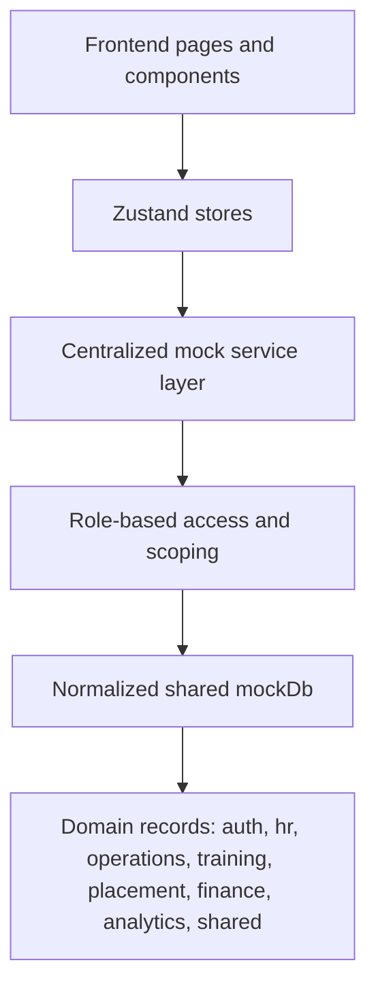
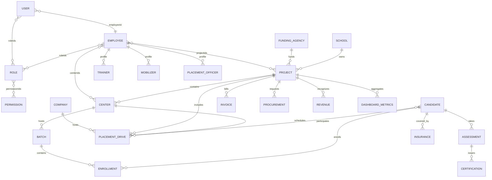
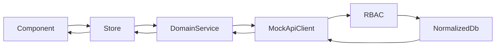
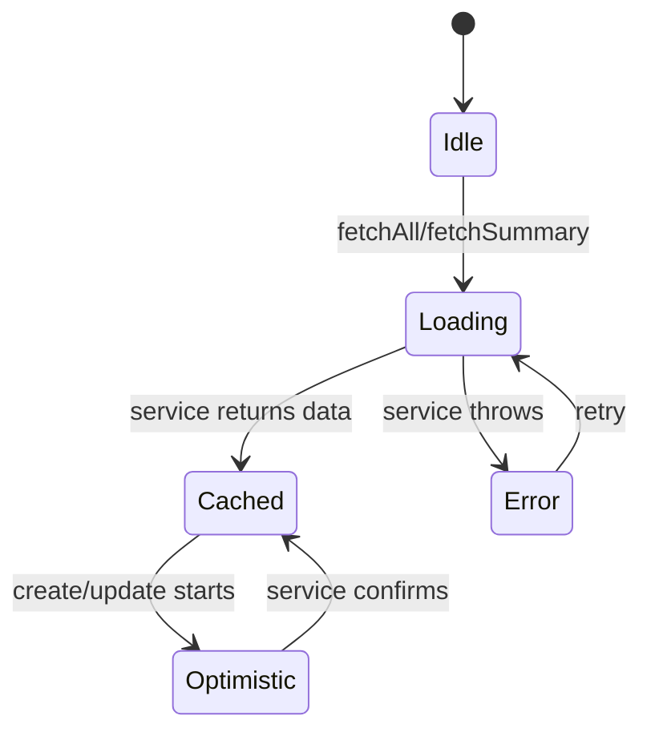
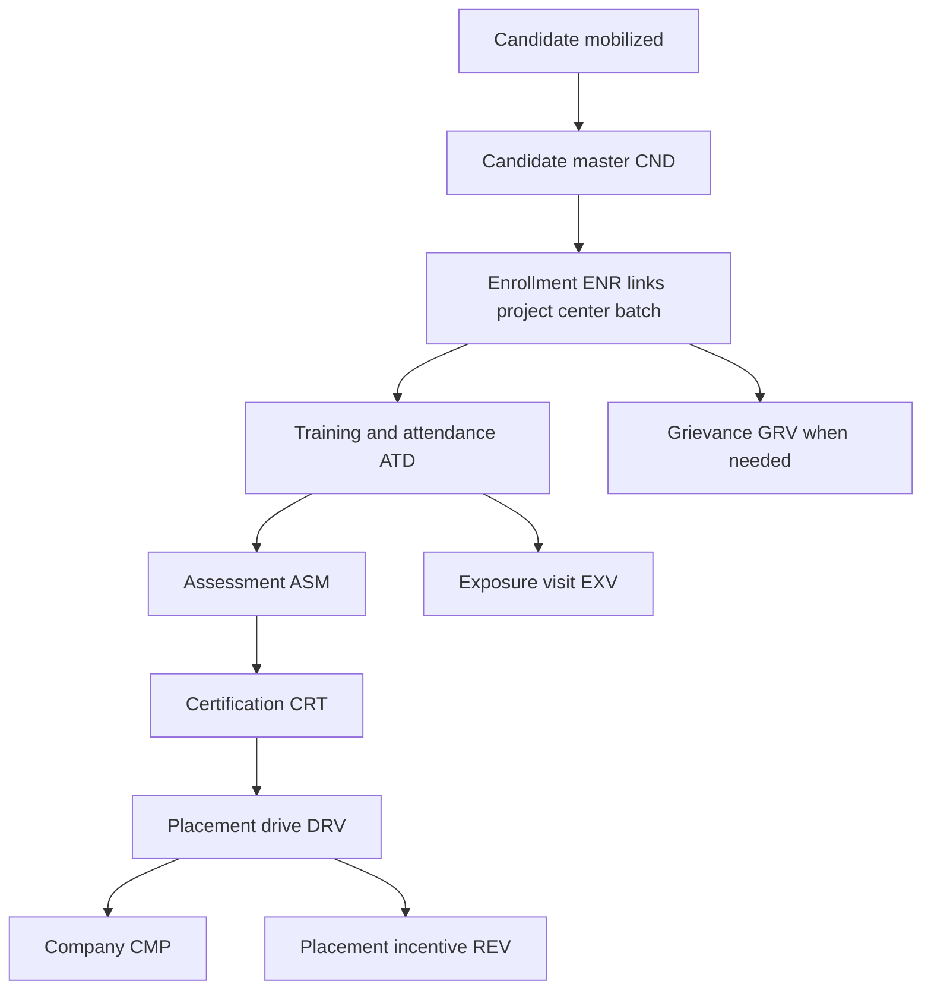

# ERP Centralized Mock Data Foundation

This pack turns the frontend prototype into a backend-shaped mock architecture. Components should no longer own inline arrays or import role-specific data islands. Pages consume Zustand stores, stores consume mock services, and mock services read/write a normalized shared mock database.

## Target Runtime Flow



## Folder Structure

```txt
src/
├── mock-db/
│   ├── analytics/
│   │   └── index.js
│   ├── auth/
│   │   └── index.js
│   ├── finance/
│   │   └── index.js
│   ├── hr/
│   │   └── index.js
│   ├── mobilization/
│   │   └── index.js
│   ├── operations/
│   │   └── index.js
│   ├── placement/
│   │   └── index.js
│   ├── shared/
│   │   ├── access-control.js
│   │   ├── enums.js
│   │   ├── id.js
│   │   ├── normalize.js
│   │   ├── relationships.js
│   │   └── schemas.js
│   ├── training/
│   │   └── index.js
│   └── index.js
├── services/
│   ├── auth.service.js
│   ├── employee.service.js
│   ├── project.service.js
│   ├── candidate.service.js
│   ├── placement.service.js
│   ├── attendance.service.js
│   ├── grievance.service.js
│   ├── finance.service.js
│   ├── dashboard.service.js
│   └── mockApiClient.js
└── stores/
    ├── authStore.js
    ├── uiStore.js
    ├── employeeStore.js
    ├── projectStore.js
    ├── candidateStore.js
    ├── attendanceStore.js
    ├── grievanceStore.js
    └── dashboardStore.js
```

## Normalized ER Diagram



## Master Entity Schemas

Master schema examples live in [schemas.js](/Users/apple/Desktop/Pantiss/ERP/src/mock-db/shared/schemas.js). The core rule is: one table per concept, foreign keys everywhere.

| Entity | Primary Key | Required Foreign Keys | Ownership |
| --- | --- | --- | --- |
| User | `USR-0001` | `employeeId`, `roleIds[]` | Auth |
| Role | `ROL-0001` | `permissionIds[]` | Auth |
| Permission | `PER-0001` | none | Auth |
| Employee | `EMP-0001` | `roleIds[]`, `projectIds[]`, `centerIds[]` | HR |
| Trainer | `TRN-0001` | `employeeId`, `batchIds[]` | HR |
| Mobilizer | `MOB-0001` | `employeeId`, `centerIds[]` | HR |
| PlacementOfficer | `PLO-0001` | `employeeId`, `projectIds[]`, `centerIds[]` | HR |
| FundingAgency | `FAG-0001` | none | Operations |
| School | `SCH-0001` | none | Operations |
| Project | `PRJ-0001` | `fundingAgencyId`, `schoolId` | Operations |
| Center | `CTR-0001` | `projectId`, `managerEmployeeId` | Operations |
| Batch | `BTH-0001` | `projectId`, `centerId`, `trainerEmployeeId` | Training |
| Candidate | `CND-0001` | `mobilizerEmployeeId` | Training |
| Enrollment | `ENR-0001` | `candidateId`, `projectId`, `centerId`, `batchId` | Training |
| Company | `CMP-0001` | none | Placement |
| PlacementDrive | `DRV-0001` | `companyId`, `projectId`, `centerId`, `candidateIds[]` | Placement |
| Attendance | `ATD-0001` | `subjectId`, `projectId`, `centerId`, `batchId` | Training |
| LeaveRequest | `LEV-0001` | `employeeId`, `approverEmployeeId` | HR |
| Salary | `SAL-0001` | `employeeId`, `projectId` | HR/Finance |
| Reimbursement | `RIM-0001` | `employeeId`, `projectId` | Finance |
| TourRequest | `TOU-0001` | `employeeId`, `projectId`, `centerId` | Mobilization |
| Grievance | `GRV-0001` | `raisedById`, `projectId`, `centerId` | Shared |
| Invoice | `INV-0001` | `projectId`, `centerId` | Finance |
| Procurement | `PRC-0001` | `projectId`, `centerId`, `requestedByEmployeeId` | Operations |
| ExposureVisit | `EXV-0001` | `projectId`, `centerId`, `batchId`, `companyId` | Operations |
| Notification | `NOT-0001` | `recipientUserId` | Shared |
| AuditLog | `AUD-0001` | `actorUserId` | Shared |
| FileUpload | `FIL-0001` | `ownerId` | Shared |
| Testimonial | `TST-0001` | `candidateId`, `projectId`, `centerId` | Shared |
| Insurance | `INS-0001` | `candidateId` | Training |
| Assessment | `ASM-0001` | `candidateId`, `batchId` | Training |
| Certification | `CRT-0001` | `candidateId`, `assessmentId` | Training |
| Revenue | `REV-0001` | `projectId`, `centerId` | Finance |
| DashboardMetrics | `MET-0001` | `scopeId` | Analytics |

## Entity Relationship Map

The relationship registry is exported from [relationships.js](/Users/apple/Desktop/Pantiss/ERP/src/mock-db/shared/relationships.js). It is intentionally explicit so future API adapters can translate frontend queries into joins without changing page code.

```txt
FundingAgency -> Project -> Center -> Batch -> Enrollment -> Candidate
Role -> Employee -> Trainer | Mobilizer | PlacementOfficer
Company -> PlacementDrive -> Candidate
Candidate -> Attendance -> Assessment -> Certification -> Placement
Project -> Invoice | Procurement | Salary | Revenue | DashboardMetrics
Employee -> LeaveRequest | Reimbursement | TourRequest | Grievance | AuditLog
```

## Role Access Matrix

Rules are implemented in [access-control.js](/Users/apple/Desktop/Pantiss/ERP/src/mock-db/shared/access-control.js).

| Role | Scope | Access |
| --- | --- | --- |
| SuperAdmin | Global | Full CRUD, approvals, exports across all entities |
| Admin | Project | Project employees, centers, batches, candidates, attendance, approvals, finance |
| Trainer | Batch | Assigned batches, candidates, attendance, assessments, exposure visits |
| Mobilizer | Center | Assigned centers, mobilized candidates, enrollments, tours, reimbursements |
| Placement Officer | Project | Assigned candidates, companies, placement drives, placement revenue |
| Client | Project | Read-only filtered access to projects, centers, metrics, testimonials, revenue |
| Executive | Global | Read-only analytics, compliance, finance, audit visibility |

## Mock Service Architecture



Services simulate network behavior with latency and return `{ data, meta }` responses. CRUD is generic, while domain services add enterprise joins:

| Service | Responsibility |
| --- | --- |
| `auth.service.js` | Mock login/session, user-role-employee join |
| `employee.service.js` | One employee master, role assignment visibility |
| `project.service.js` | Project workspace with centers and batches |
| `candidate.service.js` | Candidate lifecycle joins across enrollment, assessment, certification |
| `placement.service.js` | Company master and placement drives |
| `attendance.service.js` | Candidate and employee attendance records |
| `grievance.service.js` | Shared grievance workflows |
| `finance.service.js` | Invoices, salary, reimbursements, procurement, revenue |
| `dashboard.service.js` | Scoped metrics and enterprise summary |

## State Flow Diagram



Zustand stores cache normalized service results for view use only. They should not become a second database. The mock database remains the source of truth until real APIs replace services.

## Workflow Lifecycle Map



## Mock API Response Pattern

```js
const response = await candidateService.listLifecycle({
  currentUser,
  filters: { status: "IN_TRAINING" },
})

response.data[0]
// {
//   id: "CND-0001",
//   firstName: "Sasmita",
//   enrollment: { project, center, batch, ... },
//   assessment: null,
//   certification: null
// }
```

## Migration Strategy

1. Stop adding new inline arrays in pages.
2. For each module page, replace local data imports with a store hook.
3. Map old display labels to canonical IDs once at the boundary.
4. Delete role-specific duplicate data files after pages are migrated.
5. Keep `localStorage` only for UI preferences, draft forms, or temporary offline UX.
6. Run `validateMockDb()` after adding records to catch missing foreign keys.
7. When real APIs arrive, replace service internals only. Components and stores should keep the same contracts.

## Frontend Consumption Rule

```txt
Page -> useDomainStore -> domain.service -> mockApiClient -> mockDb
```

Do not import `mockDb` inside page components except for temporary debugging. Do not create component-level mock records. Do not duplicate projects, centers, companies, candidates, or employees for role-specific screens.

